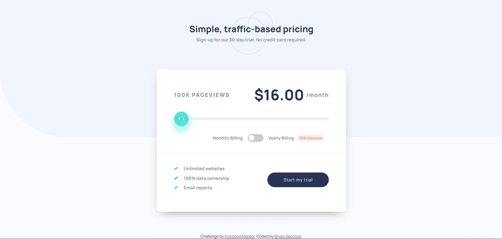

# Frontend Mentor - Interactive pricing component solution

This is a solution to the [Interactive pricing component challenge on Frontend Mentor](https://www.frontendmentor.io/challenges/interactive-pricing-component-t0m8PIyY8). Frontend Mentor challenges help you improve your coding skills by building realistic projects. 

## Table of contents

- [Frontend Mentor - Interactive pricing component solution](#frontend-mentor---interactive-pricing-component-solution)
  - [Table of contents](#table-of-contents)
  - [Overview](#overview)
    - [The challenge](#the-challenge)
    - [Screenshot](#screenshot)
    - [Links](#links)
  - [My process](#my-process)
    - [Built with](#built-with)
    - [What I learned](#what-i-learned)
    - [Continued development](#continued-development)
    - [Useful resources](#useful-resources)
  - [Author](#author)

**Note: Delete this note and update the table of contents based on what sections you keep.**

## Overview

### The challenge

Users should be able to:

- View the optimal layout for the app depending on their device's screen size
- See hover states for all interactive elements on the page
- Use the slider and toggle to see prices for different page view numbers

### Screenshot



### Links

- Solution URL: [Github](https://github.com/Bry-cmd/interactive-pricing-component-main)
- Live Site URL: [Github Pages](https://your-live-site-url.com)

## My process

### Built with

- Semantic HTML5 markup
- CSS custom properties
- Flexbox
- CSS Grid
- SCSS

### What I learned

From this challenge, I learned how to make a toggle switch and a range slider. I decided to use this challenge as an opportunity for making more interactive elements on the page aside from buttons.

I created the toggle switch first because I've already seen some implementations for it before from online, but I never coded it in myself until this challenge. I learned that the HTML structure looks like so.

```html
<label class="card__switch">
  <input class="card__checkbox" type="checkbox">
  <span class="card__slider"></span>
```

What surprised me was that, although the `input` tag is essential to the functionality of the switch, it's not actually displayed at all. From what I understand, it's mainly used for its `:checked` selector so that an action can be performed when the switch is clicked. The `label` tag is used as a container for the toggle switch while the `span` tag is what we actually see. There's a lot of CSS happening in the background and I placed comments for what each class does so I don't forget (feel free to check them out!).

The slider had a slightly more straightforward structure (for me at least) since it only required a container and the actual element that was to be the slider.

```html
<div class="card__dragcontainer">
  <input type="range" min="0" max="100" value="0" class="card__dragbar" id="myRangeD">
</div>
```

The `input` tag is the slider (although I gave it the name *dragbar* since *slider* was already taken by the toggle switch). It uses a `min` and `max` attribute to track the slider thumb's position along the slider track. The CSS is lengthy, but I also placed comments there to explain which line does what (again, feel free to check it out!). To change the background color of the slider track as the thumb moved along required some JS.

```js
const rangeDesktop = document.getElementById("myRangeD");

rangeDesktop.oninput = function() {
    const fillColor = "hsl(174, 77%, 80%)";
    const bgColor = "hsl(224, 65%, 95%)";
    let value = Math.floor((this.value - this.min) / (this.max - this.min) * 100);
    this.style.background = `linear-gradient(to right, ${fillColor} 0%, ${fillColor} ${value}%, ${bgColor} ${value}%, ${bgColor} 100%)`;
}
```

A `oninput` method, called on the `input` tag, changes the background color using a linear gradient whenever the slider thumb changes position, making it appear like the area to the left of the slider changes color as the slider moves along the track.

Another thing I learned was how to change the content and layout of the page depending on the screen size. My go-to action was to check if there was a JS function that "listened" for the screen size and change the content depending on that. However, the solution I ended up carrying out incorporated HTML in it as well. Essentially, I created a duplicate of the elements I wanted to modify and make the modifications I wanted to the duplicates. However, I'd add a `[className]--desktop`  for the copy I wanted to show on the desktop and `[className]--mobile` for the copy I wanted to show on the mobile device. 

```html
<div class="container container--desktop">
  <!-- Some content -->
</div>
<div class="container container--mobile">
  <!-- Same content as previous container -->
  <!-- but modify content to mobile design -->
</div>
```

After which, I just used the CSS `display` property to display the copy that was appropriate to the screen size.

### Continued development
For my next project, I want to start incorporating ReactJS to further improve my frontend skills since I've learned that it's a popular frontend framework. I also want to get better with animation and transitions so I can make more dynamic websites. Finally, I want to get better at responsive design, specifically how to adjust the content when the height of the page changes, not just the width. I noticed that my designs can get crammed if the screen height shortens, so I want to learn how to fix that issue.

### Useful resources
- [W3Schools](https://www.w3schools.com/) - This helped me refresh my memory on HTML, CSS, and JS
- [CSS Tricks](https://css-tricks.com/) - This is a great website that explains how to use CSS properly.
- [Stack Overflow](https://stackoverflow.com/) - This website has answers to every question I can think of when it comes to coding

## Author

- Github - [Bry-cmd](https://github.com/Bry-cmd)
- Frontend Mentor - [@Bry-cmd](https://www.frontendmentor.io/profile/Bry-cmd)
- LinkedIn - [Bryan Sanchez](https://www.linkedin.com/in/bryan-sanchez-b316b7203/)